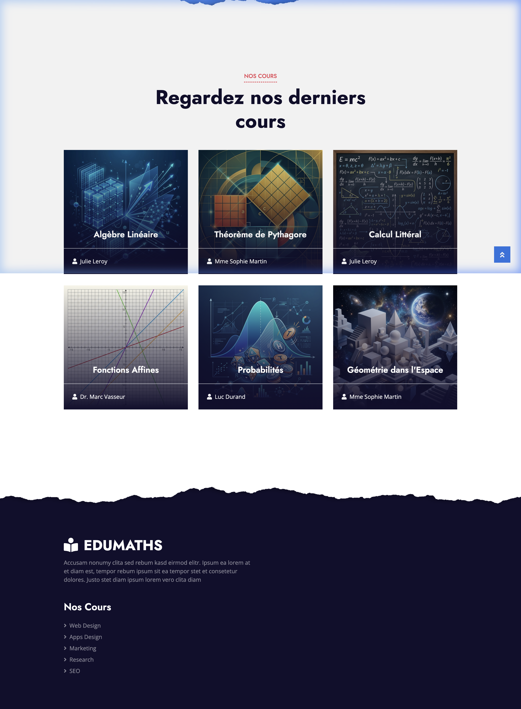
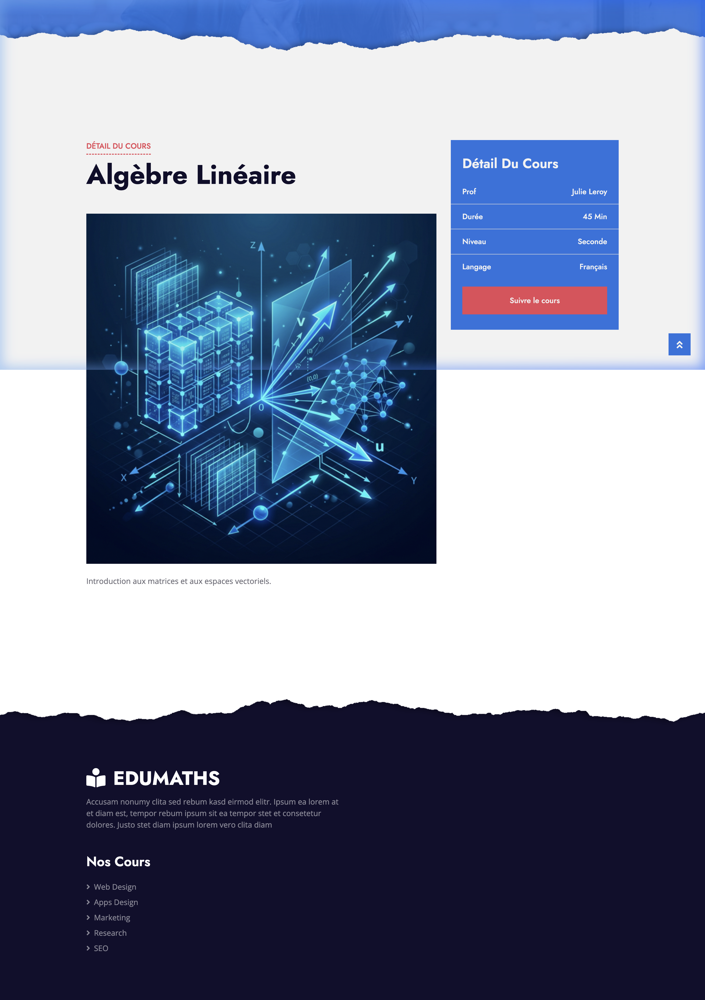

# EduMaths - Middle School Math Platform

EduMaths is a dynamic educational platform designed to help middle school students master mathematics through interactive courses and professional guidance.

> [!NOTE]
> **Project History**: I created this website when I was in 7th grade (5ème) at 12 years old, with the mission of helping other students in their math journey. It has since been refined with professional assets and a modernized architecture.

## 🖼️ Portfolio Showcase

````carousel

<!-- slide -->

<!-- slide -->

<!-- slide -->

````

## 🚀 Key Features
- **Comprehensive Course Catalog**: Interactive lessons covering Algebra, Geometry, and Probability.
- **Expert Instructor Profiles**: Detailed backgrounds of educators specialized in middle school curriculum.
- **Intelligent Search**: Global search functionality to quickly find specific topics across the platform.
- **Responsive Architecture**: Fully responsive design with high-quality, optimized imagery.

## 🛠️ Technology Stack
- **Backend**: PHP 8.x
- **Database**: SQLite (Zero-configuration database for easy local setup)
- **Frontend**: HTML5, CSS3, JavaScript, Bootstrap 4
- **Design**: Professional UI refined with modern typography and AI-augmented imagery.

## 🚦 Getting Started
To run this project locally:

1. **Clone the repository**:
   ```bash
   git clone https://github.com/floragel/EduMaths.git
   ```
2. **Initialize the Database**:
   ```bash
   php init_sqlite.php
   ```
3. **Start the PHP server**:
   ```bash
   php -S localhost:8000
   ```
4. **Access the platform**: Open `http://localhost:8000` in your browser.

---
*Developed by Nayl Lahlou.*
